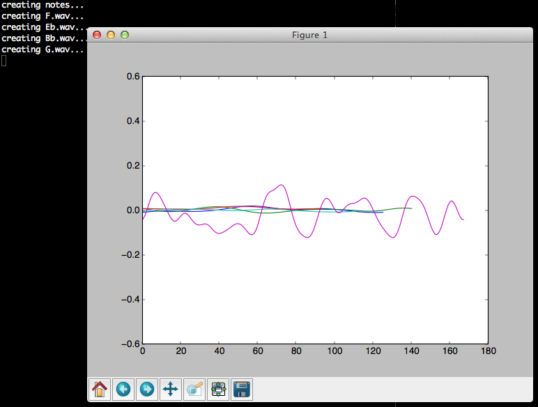

# Frequency Overtones with Python  

A small walkthrough on how to generate musical overtones with the Karplus-Strong algorithm.  

The following is borrowed from Python Playground, by Mahesh Venkitachalam.    

One of the characteristics of any musical sound is its pitch, or **frequency**. This is the number of vibrations per second in hertz (Hz). For example, the third string from the top of an acoustic guitar produces a D note, which has a frequency of 146.83 Hz. You can approximate this sound by creating a sine wave with the same vibrations per second on a computer.  

The dominant frequency you hear when you pluck the D string on a guitar, called the **fundamental frequency**, is the 146.83 Hz, but you also hear certain multiples of that frequency called **overtones**. This is true for any instrument, it is comprised of a fundamental frequency and overtones; it's the combination of these two that makes a flute sound like a flute, a guitar sound like a guitar, etc.  

So to simulate the sound of a plucked guitar string instrument on the computer, you need to be able to generate both the fundamental frequency and the overtones. To do this, we can use the **Karplus-Strong** algorithm.  

In this project, you'll generate five guitar-like notes of a musical scale (series of related notes) using the Karplus-Strong Algorithm. You'll visualize the algorithm used to generate these notes and save the sounds as WAV files. You'll also create a way to play them at random and learn how to do the following:  

* Implement a ring buffer using the Python `deque` class  
* Use `numpy` arrays and `ufuncs`  
* Play WAV files using `pygame`  
* Plot a graph using `matplotlib`  
* Play the pentatonic musical scale  

In addition to implementing the Karplus-Strong algorithm in Python, you'll also explore the WAV file format and see how to generate notes within a pentatonic musical scale.  


## How it Works  

The Karplus-Strong algorithm can simulate the sound of a plucked string by using a **ring buffer** of displacement values to simulate a string tied down at both ends, similar to a guitar string. Also known as a *circular buffer*, a ring buffer is a fixed-length (simply an array of values) that wraps around itself. In other words, when you reach the end of a buffer, the next element you access will be the first element in the buffer.  

The length (N) of the ring buffer is related to the fundamental frequency of vibration according to the equation N =S/*f*, where S is the sampling rate and *f* is the frequency.  

We'll use a **samples buffer** to store the intensity of the sound at any certain time. The length of this buffer and the sampling rate determine th elength of the sound clip.  

### Creating WAV Files  

The *Waveform Audio File Format (WAV)* is used to store audio data. This format is convienent for small audio projects, for it is simple and you do  not need to deal with complex compression techniques.  

To generate a five-second audio clip of a 220 Hz in Python, you will use a formula to represent a sine wave:

<center>  

A = sin(2π*ft*)  

</center>  

Where A is the amplitude of the wave, *f* is the frequency, and *t* is the current time index. Let's rewrite the formula to fir our needs:  

<center>  

A = sin(2π*fi*/*R*)

</center>  

*i* is the index of the sample, *R* is the sampling rate.  

Using these two equations, we can create a WAV file for a 200 Hz sine wave.  

### Create a 5-Sec WAV file for a 200 Hz Sine Wave Using Python  

```python  
import numpy as np
import wave, math

sRate = 44100
nSamples = sRate * 5
x = np.arange(nSamples)/float(sRate)
vals = np.sin(2.0*math.pi*220.0*x)
data = np.array(vals*32767, 'int16').tostring()
file = wave.open('sine220.wav', 'wb')
file.setparams((1, 2, sRate, nSamples, 'NONE', 'uncompressed'))
file.writeframes(data)
file.close()
```  

<center>  

  

</center>  

## The Minor Pentatonic Scale  

a **musical scale** is a series of notes in increasing or decreasing pitch or frequency. A **musical interval** is the difference between two pitches. Usually, all notes in a piece of music are chosen from a particular scale. A **semitone** is a basic building block of a scale and is the smallest musical interval in *western* music. A **tone** is twice the length of a semitone. The **major scale**, one of the most common musical scales, is defined by the interval pattern *tone-tone-semitone-tone-tone-tone-semitone*.  

<center>  


</center>  


